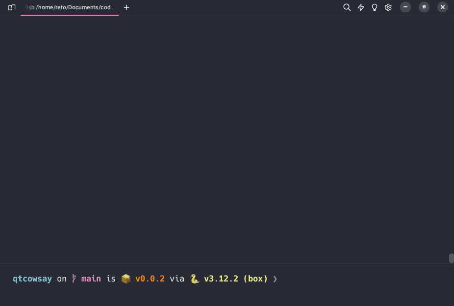

## Pre-requisites

In all of the following examples, we assume that:

1. The python environment used for the specific project is set up.
2. Cargo is installed and available (see [pre-requisites](index.md#pre-requisites)).
2. `box` is installed and available.

## qtcowsay

The following is an example on how to use `box` with a GUI project.
We will use [`qtcowsay`](https://github.com/trappitsch/qtcowsay),
a simple PyQt6 wrapper around
[`cowsay`](https://github.com/VaasuDevanS/cowsay-python), as an example.

### Step-by-step instructions

0. Clone the repository and navigate to the project directory. In the example case, the project is setup using `rye`.
1. Initialize this project as a `box` project by typing `box init`.
    1. Choose a builder: Here we choose `rye` (default).
    2. Provide optional dependnecies - not necessary for this project (default).
    3. Answer if this is a GUI project: Yes.
    4. Provide the app entry point: The automatically selected point is correct, so we choose from the list - option 0.
    5. Choose the App entry type according to PyApp's options: Here we use `spec`.
    6. Provide the Python version to package with: Here we use the default `3.12`.
    7. Provide additonal PyApp variables: Not required here (default).
2. After successfull initialization, we package the project with `box package`. This first builds the package and then packages it with PyApp. Hold on...
3. The executable is now in `target/release`.
4. Run the executable!

!!! note
    Packaging the project the first time will take a while. Use `box package -v` to get verbose output to follow the progress.
